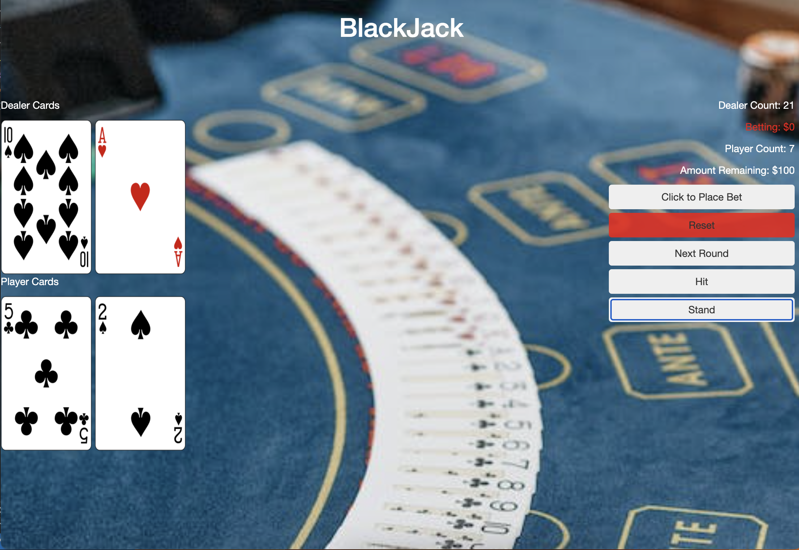

# <u>Blackjack Game</u>

###  A web application that allows the user to play the casino game Blackjack utilzing the Card Deck API.

## Technologies Used

1. JavaScript
2. CSS3
3. HTML5
4. jQuery
5. Card Deck API

## ScreenShots

## Playing the Game
* Instructions once game has begun: 
    * Click 'Hit' button to draw an additional card
    * Click 'Stand' button to end drawing and dealer will play.
    * At end of round please click place 'Bet' button then click 'Next round' button

Please click the [LINK](https://danf8.github.io/Blackjack-game/) to launch the deployed app

## Future Enhancements
* Add mobile design
* Add additional betting amounts
